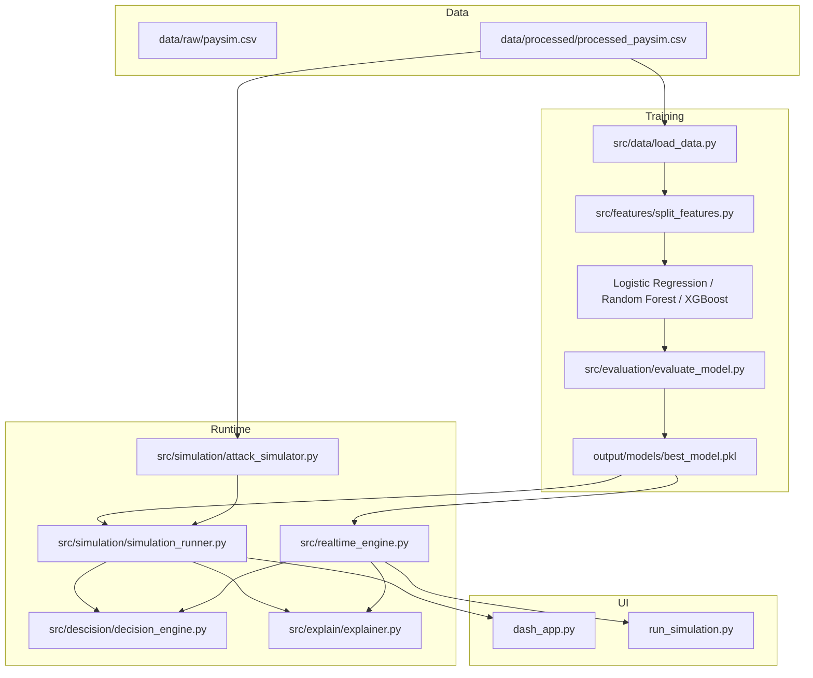

# Credit Card Fraud Detection System

A machine learning pipeline for **credit card / mobile money fraud detection** built on the [PaySim](https://www.kaggle.com/datasets/ealaxi/paysim1) synthetic financial dataset. The project trains and compares several classifiers, selects the best model by ROC-AUC, simulates adversarial transaction patterns, scores transactions in a near–real-time engine, maps risk to operational actions (ALLOW / REVIEW / BLOCK), and exposes results through a Plotly Dash dashboard.

This README documents how the repository is organized and how each component fits together. **No application code is modified here**—only project documentation.

---

## Table of Contents

1. [Project goals](#project-goals)
2. [Dataset](#dataset)
3. [System architecture](#system-architecture)
4. [Repository structure](#repository-structure)
5. [Features used by the models](#features-used-by-the-models)
6. [Machine learning pipeline](#machine-learning-pipeline)
7. [Model selection and artifacts](#model-selection-and-artifacts)
8. [Decision engine](#decision-engine)
9. [Explainability layer](#explainability-layer)
10. [Fraud attack simulation](#fraud-attack-simulation)
11. [Real-time fraud engine](#real-time-fraud-engine)
12. [Dashboard](#dashboard)
13. [How to run the project](#how-to-run-the-project)
14. [Dependencies](#dependencies)
15. [Configuration and thresholds](#configuration-and-thresholds)
16. [Notebook](#notebook)
17. [Design notes and limitations](#design-notes-and-limitations)
18. [Possible future work](#possible-future-work)

---

## Project goals

Traditional fraud systems do more than output a probability. This project models a **mini production-style stack**:

| Capability | Description |
|------------|-------------|
| **Training** | Train Logistic Regression, Random Forest, and XGBoost on imbalanced fraud data |
| **Model selection** | Pick the winner using **ROC-AUC** on a held-out test set |
| **Attack simulation** | Stress-test the model with synthetic attack traffic (high value, floods, noise) |
| **Decisions** | Turn probabilities into **ALLOW**, **REVIEW**, or **BLOCK** (depending on component) |
| **Explainability** | Narrative explanations plus top feature evidence for flagged transactions |
| **Real-time path** | Score transactions one-by-one with latency tracking |
| **Visualization** | Interactive Dash UI for simulation runs and metrics |

The focus is **CS363-style systems + ML engineering**: evaluation under stress, operational thresholds, and interpretable outputs—not only offline accuracy.

---

## Dataset

### Source: PaySim

PaySim simulates mobile money transactions inspired by real financial logs. The raw file in this repo is:

- `data/raw/paysim.csv` — full dataset (~6.36M rows; listed in `.gitignore` for size, may need to be downloaded separately)

### Processed training data

Training and simulation use a **smaller, feature-engineered** file:

- `data/processed/processed_paysim.csv` — **28,296** transactions (~0.30% fraud rate)

The notebook `notebooks/Credit_Card_Fraud_Detection.ipynb` documents exploratory analysis and preprocessing on the full PaySim CSV (encoding transaction types, balance deltas, log amounts, error flags, etc.). The processed CSV is what the Python modules load at runtime.

### Labels

| Column | Role |
|--------|------|
| `isFraud` | **Target** — `1` = fraudulent, `0` = legitimate |
| `isFlaggedFraud` | PaySim’s internal flag; **dropped** from features (not used as model input) |

---

## System architecture

End-to-end flow from data to dashboard:



**Batch simulation path** (dashboard): sample transactions → build attack suite → batch `predict_proba` → decision + explanations → confusion matrix.

**Real-time path** (`run_simulation.py`): same attack suite, but each row is scored through `RealtimeFraudEngine.process_transaction()` with per-transaction latency.

---

## Repository structure

```
Credit-Card-Fraud-Detection/
├── data/
│   ├── raw/                    # Original PaySim CSV (often gitignored)
│   └── processed/
│       └── processed_paysim.csv
├── notebooks/
│   └── Credit_Card_Fraud_Detection.ipynb
├── output/
│   └── models/                 # Trained artifacts (best model + metadata)
│       ├── best_model.pkl
│       ├── best_model_meta.json
│       ├── best_model_scaler.pkl   # Present only if best model needs scaling
│       ├── logistic_regression.pkl
│       ├── random_forest.pkl
│       └── xgboost.pkl
├── src/
│   ├── data/                   # load_processed_data()
│   ├── features/               # Train/test feature split
│   ├── models/                 # Per-algorithm training wrappers
│   ├── training/               # Full training pipeline + config
│   ├── evaluation/             # Metrics and training plots
│   ├── simulation/             # Attack generator + batch runner
│   ├── descision/              # FraudDecisionEngine (note folder spelling)
│   └── explain/                # FraudExplainer
├── dash_app.py                 # Plotly Dash dashboard
├── run_simulation.py           # CLI real-time flood evaluation
├── main.py                     # Alternate entry (see Design notes)
└── README.md
```

---

## Features used by the models

After preprocessing, each row includes **numeric and one-hot** fields. Training uses all columns except `isFraud` and `isFlaggedFraud`.

| Feature | Meaning |
|---------|---------|
| `step` | Time step in the simulation |
| `amount` | Transaction amount |
| `oldbalanceOrg`, `newbalanceOrig` | Sender balance before/after |
| `oldbalanceDest`, `newbalanceDest` | Receiver balance before/after |
| `balance_diff_orig`, `balance_diff_dest` | Engineered balance changes |
| `type_CASH_OUT`, `type_DEBIT`, `type_PAYMENT`, `type_TRANSFER` | One-hot transaction type |
| `is_high_amount` | Flag for unusually large amounts |
| `amount_log` | Log-transformed amount |
| `error_orig`, `error_dest` | Accounting inconsistency signals |
| `high_risk_transaction` | Composite risk flag |

The explainer (`src/explain/explainer.py`) includes human-readable hints for these fields when generating evidence.

---

## Machine learning pipeline

### Entry point (recommended)

From the **project root** (required so relative paths like `data/processed/...` resolve):

```bash
python -m src.training.train
```

### Steps performed

1. **Load** `processed_paysim.csv` via `load_processed_data()`.
2. **Split** features and label with `split_features()`.
3. **Train/test split** — 80/20, `random_state=42`, **stratified** on `isFraud`.
4. **Train three models** (each in `src/models/`):
   - **Logistic Regression** — SMOTE on training set, `StandardScaler`, `max_iter=1000`
   - **Random Forest** — SMOTE, `n_estimators=100`, `random_state=42`
   - **XGBoost** — SMOTE, default `XGBClassifier` with `eval_metric="logloss"`
5. **Evaluate** each model: accuracy, F1, ROC-AUC, confusion matrix, ROC curve data.
6. **Select best model** — highest **ROC-AUC** on the test set.
7. **Visualize** — matplotlib/seaborn heatmaps (confusion matrices), ROC comparison, ROC-AUC bar chart (`show_final_visualization`).
8. **Persist** best model to `output/models/best_model.pkl` plus `best_model_meta.json` (and `best_model_scaler.pkl` if the winner is Logistic Regression).

### Imbalance handling

All three trainers apply **SMOTE** (`imblearn.over_sampling.SMOTE`, `random_state=42`) on the training fold only. This oversamples the minority (fraud) class so tree and linear models are not dominated by legitimate transactions.

Hyperparameters for experiments are centralized in `src/training/config.py` (e.g. `RF_PARAMS`, `XGB_PARAMS`, `SMOTE_ENABLED`); the model modules currently use inline defaults that closely match those settings.

### Metrics reported

| Metric | Use in this project |
|--------|---------------------|
| **ROC-AUC** | Primary metric for **choosing the best model** |
| Accuracy | Printed per model during training |
| F1 | Printed per model during training |
| Confusion matrix | Per-model during training; per-attack and overall in simulation |
| Precision / Recall | Available via `evaluate_model()` helper; classification reports in `run_simulation.py` |

For highly imbalanced fraud data, **ROC-AUC and recall on fraud** are usually more informative than accuracy alone.

---

## Model selection and artifacts

### Selection rule

```text
best_model = argmax(ROC-AUC on test set)
```

### Saved files

| File | Contents |
|------|----------|
| `output/models/best_model.pkl` | Serialized sklearn / XGBoost estimator |
| `output/models/best_model_meta.json` | Model name, slug, ROC-AUC, `has_scaler` flag |
| `output/models/best_model_scaler.pkl` | StandardScaler (only when best model is Logistic Regression) |

Individual runs also save:

- `output/models/logistic_regression.pkl` + `logistic_scaler.pkl`
- `output/models/random_forest.pkl`
- `output/models/xgboost.pkl`

### Current best model (example from committed metadata)

```json
{
  "model_name": "Random Forest",
  "model_name_slug": "random_forest",
  "roc_auc": 0.9998749100916284,
  "has_scaler": false
}
```

Re-run training after data or code changes to refresh these artifacts.

---

## Decision engine

Implementation: `src/descision/decision_engine.py` — class `FraudDecisionEngine`.

### Batch simulation and dashboard

Uses a **single threshold** (default **0.3** in the dashboard and simulation runner):

| Condition | Decision | Binary prediction |
|-----------|----------|-------------------|
| `P(fraud) >= threshold` | **BLOCK** | `1` (fraud) |
| `P(fraud) < threshold` | **ALLOW** | `0` (legitimate) |

There is no separate REVIEW tier in the batch `FraudDecisionEngine`; REVIEW appears only in the real-time engine (below).

### Real-time engine (`RealtimeFraudEngine`)

Uses **two thresholds** (defaults: `block_threshold=0.3`, `alert_threshold=0.12`):

| Probability range | Decision | Action channel |
|-------------------|----------|----------------|
| `p >= block_threshold` | **BLOCK** | `BLOCK` |
| `alert_threshold <= p < block_threshold` | **REVIEW** | `ALERT` |
| `p < alert_threshold` | **ALLOW** | `LOG` |

`predicted_fraud_label()` still treats fraud as `p >= block_threshold`, matching the batch binary rule for evaluation in `run_simulation.py`.

---

## Explainability layer

`FraudExplainer` (`src/explain/explainer.py`) builds structured explanations for each scored transaction:

- **Attack analysis** — description of the simulation scenario (baseline, high value, rapid fire, noise)
- **Prediction summary** — why ALLOW / REVIEW / BLOCK given the probability and thresholds
- **Truth analysis** — TP / TN / FP / FN narrative when ground-truth labels are available
- **Feature evidence** — top-*k* features by global importance (`feature_importances_` for trees, `|coef_|` for linear models), with values and interpretations

The dashboard and `simulation_runner` cap how many rows receive full feature evidence (`max_explanations`) to keep runs fast. The real-time engine can skip explanations entirely (`skip_explanations=True`) during flood tests.

---

## Fraud attack simulation

### `FraudAttackSimulator`

`src/simulation/attack_simulator.py` takes a base feature matrix `X` and labels `y_true`, then builds an **attack suite**:

| Scenario | What it does |
|----------|----------------|
| `normal_baseline` | Unmodified sample — production-like traffic |
| `high_value_flood` | Multiplies `amount` by 12× (configurable) |
| `rapid_fire_flood` | Repeats the batch `flood_repeats` times (simulates volume spike) |
| `random_noise_flood` | Adds Gaussian multiplicative noise (12%) to numeric columns |

Labels stay aligned with the original rows (attacks change features, not ground-truth fraud labels unless you extend the simulator).

### `run_simulation` (batch)

`src/simulation/simulation_runner.py`:

1. Builds the attack suite.
2. Runs `predict_proba` on each scenario.
3. Applies `FraudDecisionEngine` and `FraudExplainer`.
4. Returns per-attack and **overall** confusion matrices, flat per-transaction results, and explanation payloads.

Used by **`dash_app.py`** when you click **Run Attack Simulation**.

### `run_simulation.py` (real-time flood)

CLI script that:

1. Samples a stratified subset from `processed_paysim.csv`.
2. Streams every attack row through **`RealtimeFraudEngine`**.
3. Prints per-scenario and overall confusion matrices, classification reports, and **latency** (mean, p95, max in ms).

Default flood settings: `block_threshold=0.3`, `alert_threshold=0.12`, `flood_repeats=12`.

---

## Real-time fraud engine

`src/realtime_engine.py` — class **`RealtimeFraudEngine`**.

**Pipeline per transaction:**

```text
Incoming dict/Series → align features → predict_proba → tier decision → explain (optional) → log / hooks
```

- Loads `best_model.pkl` (+ scaler if needed) from `output/models/`.
- Infers feature order from `model.feature_names_in_` or from the processed CSV header.
- Returns `RealtimeOutcome` (probability, decision, action, explanation, latency_ms).
- Supports `process_stream()` for iterables and optional `alert_hook` / `block_hook` callbacks.

**Demo:**

```bash
python -m src.realtime_engine
```

Streams a small random sample from the processed CSV and prints decisions to the console.

---

## Dashboard

**File:** `dash_app.py`  
**Run:**

```bash
python dash_app.py
```

Opens at **http://127.0.0.1:8050** (debug mode enabled in code).

### UI capabilities

- **Run Attack Simulation** — triggers `run_simulation()` with adjustable **threshold** and **flood repeats**
- **Predictions table** — attack type, probability, decision, true/pred labels, explanation snippets
- **Confusion matrix** — Plotly heatmap (overall across all scenarios)
- **System metrics** — TP, TN, FP, FN
- **Live event logs** — terminal-style trace of transactions
- **Attack scenario explanations** — static descriptions for each attack type

Requires a trained `output/models/best_model.pkl`. If missing, the app raises `FileNotFoundError` with the expected path.

---

## How to run the project

Always start from the repository root:

```bash
cd Credit-Card-Fraud-Detection
```

### 1. Install dependencies

There is no `requirements.txt` in the repo; install packages used by imports (see [Dependencies](#dependencies)).

### 2. Ensure data and model exist

- `data/processed/processed_paysim.csv` — included in the repo (subset).
- Train models if `output/models/best_model.pkl` is missing:

```bash
python -m src.training.train
```

### 3. Optional workflows

| Goal | Command |
|------|---------|
| Train & save best model | `python -m src.training.train` |
| Real-time flood + metrics (CLI) | `python run_simulation.py` |
| Interactive dashboard | `python dash_app.py` |
| Real-time engine demo | `python -m src.realtime_engine` |

### 4. Explore in Jupyter

Open `notebooks/Credit_Card_Fraud_Detection.ipynb` for EDA, preprocessing rationale, and Colab-oriented experiments on the full PaySim file.

---

## Dependencies

Install via pip (versions flexible; pin in your environment as needed):

| Package | Used for |
|---------|----------|
| `pandas` | Data I/O and feature matrices |
| `numpy` | Numerical operations |
| `scikit-learn` | Models, metrics, splits, scaling |
| `xgboost` | XGBClassifier |
| `imbalanced-learn` | SMOTE |
| `joblib` | Model persistence |
| `matplotlib`, `seaborn` | Training visualizations |
| `dash`, `plotly` | Dashboard |

Example one-liner:

```bash
pip install pandas numpy scikit-learn xgboost imbalanced-learn joblib matplotlib seaborn dash plotly
```

---

## Configuration and thresholds

| Setting | Location | Default | Notes |
|---------|----------|---------|-------|
| Test split | `src/training/train.py` | 20%, stratified | `random_state=42` |
| SMOTE | Each `src/models/*.py` | `random_state=42` | Training only |
| Batch fraud threshold | Dashboard / `run_simulation` | `0.3` | `P(fraud) >= threshold` → BLOCK |
| Real-time block threshold | `RealtimeFraudEngine` | `0.3` | Same binary fraud rule |
| Real-time alert threshold | `RealtimeFraudEngine` | `0.12` | REVIEW / ALERT band |
| Flood repeats (CLI) | `run_simulation.py` | `12` | Rapid-fire scenario size |
| Flood repeats (dashboard) | `dash_app.py` input | `8` | User-adjustable |
| `THRESHOLD` in config | `src/training/config.py` | `0.75` | Documented for tuning; batch engine uses caller-passed values |

Lower thresholds → more fraud alerts (higher recall, more false positives). Tune for your cost of missing fraud vs. blocking legitimate payments.

---

## Notebook

`notebooks/Credit_Card_Fraud_Detection.ipynb` is the **research and preprocessing** companion:

- Loads PaySim from CSV
- Explores types, balances, and fraud rate
- Engineers features that appear in `processed_paysim.csv`
- Experiments with classical ML (and mentions deep learning in the introduction)

The production-style modules under `src/` consume the processed CSV so notebook and package workflows stay separated.

---

## Design notes and limitations

1. **Working directory** — `load_data.py` reads `data/processed/processed_paysim.csv` with a relative path; run commands from the project root.

2. **`main.py`** — Imports `train_pipeline` from `src.training.train`, but the training module exposes `main()` via `python -m src.training.train`, not `train_pipeline`. It also saves to `models/best_model.pkl` instead of `output/models/`. Use **`python -m src.training.train`** as the supported training command unless `main.py` is updated separately.

3. **Class imbalance** — ~0.3% fraud in the processed set; SMOTE helps training but operational metrics on streamed attacks should be interpreted with care.

4. **Attack simulation** — Scenarios mutate features while keeping original labels; they test **robustness and throughput**, not new labeled fraud types.

5. **Explainability** — Uses global feature importances, not SHAP or LIME; fast and model-native but less local than instance-level SHAP.

6. **Raw data size** — Full `paysim.csv` is large (~6M rows) and may be gitignored; the committed processed subset keeps the repo cloneable while remaining representative.

7. **Folder name** — Decision logic lives under `src/descision/` (typo in path); imports use that spelling consistently.

---

## Possible future work

Ideas aligned with the codebase and comments elsewhere in the project:

- Add a pinned `requirements.txt` or `pyproject.toml`
- Unify `main.py` with `src.training.train`
- SHAP or LIME for local explanations
- FastAPI REST endpoint wrapping `RealtimeFraudEngine`
- Kafka (or similar) for true streaming ingestion
- Drift detection on feature distributions
- PostgreSQL (or other store) for audit logs of BLOCK/REVIEW decisions
- Auth and multi-user dashboard deployment

---

## Summary

This repository implements a **full fraud-detection workflow**: train and compare models on PaySim-derived data, persist the ROC-AUC winner, stress-test with synthetic attacks, score transactions in batch or pseudo–real-time, explain decisions in plain language, and visualize results in Dash. It is suitable as a **course project (CS363)** or prototype for how financial monitoring pipelines combine ML with operational policy.

For questions about a specific module, start from the file paths in [Repository structure](#repository-structure) and the architecture diagram above.
