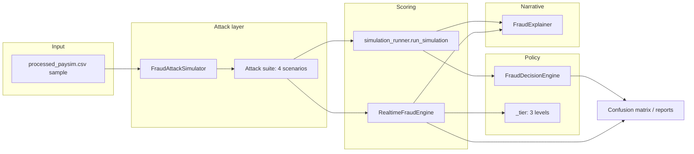

# Fraud Attack Simulation — Technical Guide

This document describes **only the simulation subsystem**: how synthetic attack traffic is generated, scored, decided, explained, and evaluated. It covers the modules listed below and does not document model training or the Dash dashboard (except where the dashboard calls the batch runner).

| Module | Role |
|--------|------|
| `src/simulation/attack_simulator.py` | Build attack scenarios from a transaction sample |
| `src/simulation/simulation_runner.py` | Batch scoring + metrics + explanations |
| `src/descision/decision_engine.py` | Map fraud probability → ALLOW / BLOCK |
| `src/explain/explainer.py` | Narratives and feature evidence |
| `src/realtime_engine.py` | Per-transaction scoring (ALLOW / REVIEW / BLOCK) |
| `run_simulation.py` | CLI: real-time flood through the engine |

---

## Table of Contents

1. [Purpose](#purpose)
2. [High-level architecture](#high-level-architecture)
3. [Two execution modes](#two-execution-modes)
4. [Attack generation (`FraudAttackSimulator`)](#attack-generation-fraudattacksimulator)
5. [Batch simulation (`run_simulation`)](#batch-simulation-run_simulation)
6. [Decision engine (`FraudDecisionEngine`)](#decision-engine-frauddecisionengine)
7. [Explainability (`FraudExplainer`)](#explainability-fraudexplainer)
8. [Real-time engine (`RealtimeFraudEngine`)](#real-time-engine-realtimefraudengine)
9. [CLI flood runner (`run_simulation.py`)](#cli-flood-runner-run_simulationpy)
10. [Thresholds and evaluation rules](#thresholds-and-evaluation-rules)
11. [Return structures and console output](#return-structures-and-console-output)
12. [How to run](#how-to-run)
13. [Important behaviors and caveats](#important-behaviors-and-caveats)

---

## Purpose

The simulation layer answers: **“How does our fraud model behave under stress?”**

It does **not** create new fraud labels. It takes a real sample of transactions (with ground-truth `isFraud`), **mutates or repeats** feature rows to mimic attack patterns, runs them through the trained classifier, and measures:

- Fraud probabilities and operational decisions
- Confusion matrices (TP / TN / FP / FN) per scenario and overall
- Human-readable explanations (batch path)
- End-to-end latency per transaction (real-time path)

This mimics how a bank might replay or synthesize traffic to test monitoring rules before production.

---

## High-level architecture



**Shared first step:** sample rows from CSV → `X_sample` (features) + `y_sample` (labels) → `FraudAttackSimulator` → list of `(scenario_name, X_attack, y_attack)`.

**Then the paths diverge:**

- **Batch:** vectorized `predict_proba` on entire attack frames → `FraudDecisionEngine` + `FraudExplainer` on every row.
- **Real-time:** loop rows → `RealtimeFraudEngine.process_transaction()` one at a time → binary label via `predicted_fraud_label()`.

---

## Two execution modes

| Aspect | Batch (`simulation_runner`) | Real-time (`run_simulation.py` + `RealtimeFraudEngine`) |
|--------|----------------------------|----------------------------------------------------------|
| **Entry** | `run_simulation(model, X, y, ...)` (also used by `dash_app.py`) | `python run_simulation.py` or `run_realtime_flood_with_engine()` |
| **Scoring** | Whole `DataFrame` at once | One dict/Series per call |
| **Decisions** | ALLOW or BLOCK only | ALLOW, REVIEW, or BLOCK |
| **Binary eval label** | `fraud_prediction_label(p)` @ `threshold` | Same, via `block_threshold` only |
| **Explanations** | Yes (budget-limited feature evidence) | Disabled in flood (`skip_explanations=True`) |
| **Latency** | Not measured | `latency_ms` per transaction |
| **Output** | Python dict + optional `print_evaluation_report` | Printed confusion matrix + classification report |

For **comparing model accuracy** across scenarios, both modes use the **same binary rule**: predicted fraud iff `P(fraud) >= block_threshold` (default `0.3`). REVIEW in the real-time engine does not change that binary metric.

---

## Attack generation (`FraudAttackSimulator`)

**File:** `src/simulation/attack_simulator.py`

### Constructor

```python
FraudAttackSimulator(X: pd.DataFrame, y_true: pd.Series)
```

- `X`: feature matrix only (no `isFraud` / `isFlaggedFraud`).
- `y_true`: aligned labels, same length as `X`.
- Raises `ValueError` if lengths differ.
- Stores copies with reset index.

### Individual attack methods

| Method | Effect | Labels |
|--------|--------|--------|
| `high_value_attack(multiplier=10.0)` | Multiplies column `amount` by `multiplier` | Unchanged copy of `y_true` |
| `rapid_fire_attack(repeats=50)` | Concatenates `X` and `y_true` `repeats` times | Repeated in sync |
| `random_noise_attack(noise_level=0.1)` | For each numeric column: `col * (1 + N(0, noise_level))`, RNG seed `42` | Unchanged |

Attacks change **features only**, not whether a row was originally fraud in the dataset.

### Attack suite (`build_attack_suite`)

```python
build_attack_suite(
    *,
    flood_repeats: int = 40,
    noise_level: float = 0.12,
    high_value_multiplier: float = 12.0,
) -> list[tuple[str, pd.DataFrame, pd.Series]]
```

Returns **four scenarios in fixed order**:

| # | Scenario name | Description |
|---|---------------|-------------|
| 1 | `normal_baseline` | Unmodified `X`, `y_true` |
| 2 | `high_value_flood` | Amount × `high_value_multiplier` (default 12) |
| 3 | `rapid_fire_flood` | Batch repeated `flood_repeats` times |
| 4 | `random_noise_flood` | Numeric columns perturbed (`noise_level` default 0.12) |

Each tuple is `(scenario_name, X_attack, y_attack)` ready for scoring.

**Volume note:** `rapid_fire_flood` multiplies row count by `flood_repeats`. With a base sample of ~280 rows and `flood_repeats=12`, that scenario alone contributes thousands of transactions to the overall evaluation.

---

## Batch simulation (`run_simulation`)

**File:** `src/simulation/simulation_runner.py`

### Main API

```python
run_simulation(
    model,
    X_sample,
    y_sample,
    feature_names,
    *,
    threshold: float = 0.3,
    flood_repeats: int = 40,
    scaler=None,
    max_explanations: int = 15,
) -> dict
```

### Pipeline (per run)

1. Create `FraudDecisionEngine(threshold=threshold)`.
2. Create `FraudExplainer()`.
3. `FraudAttackSimulator(X_sample, y_sample).build_attack_suite(flood_repeats=flood_repeats)`.
4. For each scenario:
   - `_predict_proba(model, X_attack, scaler)` → vector of fraud probabilities.
   - `_evaluate_attack_batch(...)` → per-row decisions, explanations, confusion matrix.
5. Aggregate all scenarios into **overall** confusion matrix and counts.

### `_predict_proba`

- If `scaler` is provided: `scaler.transform(X.values)` then `model.predict_proba(...)[:, 1]`.
- Else: `model.predict_proba(X)[:, 1]` directly.

### `_evaluate_attack_batch`

For each row index `i`:

1. `probability = probs[i]`
2. `decision = engine.decide(probability)` → `"BLOCK"` or `"ALLOW"`
3. `pred = engine.fraud_prediction_label(probability)` → `0` or `1`
4. `explainer.explain_fraud_prediction(...)` with attack name, true/pred labels, optional feature evidence (see [Explainability](#explainability-fraudexplainer))
5. Append to `detailed_rows`

Returns per-attack dict with: `attack_name`, `attack_description`, `confusion_matrix`, `counts`, `y_true`, `y_pred`, `probabilities`, `rows`.

### Return value shape

```python
{
    "threshold": float,
    "per_attack": [ ... attack_summary dicts ... ],
    "overall": {
        "confusion_matrix": np.ndarray,  # 2x2
        "counts": {"TN", "FP", "FN", "TP"},
        "total_transactions": int,
    },
    "flat_results": [ ... one dict per transaction across all scenarios ... ],
}
```

Each `flat_results` entry:

```python
{
    "attack_type": str,
    "probability": float,
    "decision": "ALLOW" | "BLOCK",
    "true_fraud": int,
    "pred_fraud": int,
    "explanation": dict,  # from FraudExplainer
}
```

### `print_evaluation_report(summary, preview_rows=10)`

Console helper: prints threshold, per-attack metrics/descriptions, overall TP/TN/FP/FN, and a sample of detailed explanations.

---

## Decision engine (`FraudDecisionEngine`)

**File:** `src/descision/decision_engine.py`

Small, stateless policy object used in **batch simulation** and embedded inside **real-time engine** for binary labels.

```python
class FraudDecisionEngine:
    def __init__(self, threshold: float = 0.3):
        self.threshold = float(threshold)

    def decide(self, probability: float) -> str:
        # >= threshold → "BLOCK", else "ALLOW"

    def fraud_prediction_label(self, probability: float) -> int:
        # >= threshold → 1 (fraud), else 0 (legitimate)
```

| Probability | `decide()` | `fraud_prediction_label()` |
|-------------|------------|----------------------------|
| `p >= threshold` | `BLOCK` | `1` |
| `p < threshold` | `ALLOW` | `0` |

There is **no REVIEW** tier in this class. Batch simulation and dashboard metrics are strictly two-class from this threshold.

The real-time engine uses a **separate** three-tier mapping in `_tier()` for operational `decision` / `action`, but evaluation in `run_simulation.py` still uses `fraud_prediction_label()` (binary at `block_threshold` only).

---

## Explainability (`FraudExplainer`)

**File:** `src/explain/explainer.py`

Supports simulation by documenting attacks and explaining each scored transaction.

### Attack scenario text (`describe_attack_scenario`)

Static descriptions for the four built-in scenario names (see `_ATTACK_SCENARIO_DETAIL`). Unknown names get a generic fallback message.

Used in batch runner as `attack_description` on each per-attack summary.

### Feature hints (`_FEATURE_HINTS`)

Maps column names (e.g. `amount`, `error_orig`, `type_TRANSFER`) to short human descriptions used when building feature evidence lines.

### `explain_fraud_prediction(...)`

Main method called for **every row** in batch simulation (feature evidence only for the first `max_explanations` rows globally across the whole run, via a shared `explain_budget` counter).

**Key parameters:**

| Parameter | Role in simulation |
|-----------|-------------------|
| `decision` | ALLOW / BLOCK (batch) or ALLOW / REVIEW / BLOCK (real-time) |
| `fraud_probability` | Model output used in narrative |
| `block_threshold` | Referenced in decision text |
| `review_threshold` | Passed in real-time path; `None` in batch |
| `attack_type` | Scenario name (e.g. `high_value_flood`) |
| `true_fraud_label` / `pred_fraud_label` | Drives TP/TN/FP/FN narrative |
| `include_feature_evidence` | If true, top-k global importances + sample values |
| `top_k` | Default 5 features |

**Returns a dict:**

```python
{
    "attack_type": str | None,
    "attack_analysis": str,       # scenario description
    "decision": str,
    "fraud_probability": float,
    "prediction_summary": str,    # threshold narrative
    "truth_analysis": str | None, # correct / FP / FN text
    "feature_evidence": list | None,
}
```

### Feature evidence (`explain_tree_model`)

- Tree models: `model.feature_importances_`
- Linear models: `|coef_|`
- Picks top-k indices, attaches sample values and `interpretation` strings

Batch path sets `include_feature_evidence=True` only while `explain_budget > 0`; otherwise explanations still include attack/decision/truth text without per-feature rows.

### Real-time usage

When `skip_explanations=False`, `RealtimeFraudEngine` calls `explain_fraud_prediction` with:

- `include_feature_evidence=(decision != "ALLOW")`
- `attack_type=None`, no ground-truth labels (live scoring)

`run_simulation.py` sets `skip_explanations=True` for speed during floods.

---

## Real-time engine (`RealtimeFraudEngine`)

**File:** `src/realtime_engine.py`

Simulates **production-style** processing: one transaction in, one `RealtimeOutcome` out.

### Pipeline per transaction

```text
transaction (dict | Series)
    → align features to model column order
    → predict_proba (with optional scaler)
    → _tier(probability) → decision + action
    → optional FraudExplainer
    → logging / hooks
    → RealtimeOutcome
```

### Initialization

Loads from project root (by default):

- `output/models/best_model.pkl`
- `output/models/best_model_meta.json` (checks `has_scaler`)
- `output/models/best_model_scaler.pkl` if needed

Infers `feature_names` from `model.feature_names_in_` or from header of `data/processed/processed_paysim.csv`.

Constructs:

- `FraudDecisionEngine(threshold=block_threshold)` — used only for `predicted_fraud_label()`
- `FraudExplainer()`

**Validation:** `alert_threshold` must be `<= block_threshold`.

### Three-tier policy (`_tier`)

| Condition | `decision` | `action` |
|-----------|------------|----------|
| `p >= block_threshold` | `BLOCK` | `BLOCK` |
| `alert_threshold <= p < block_threshold` | `REVIEW` | `ALERT` |
| `p < alert_threshold` | `ALLOW` | `LOG` |

Defaults: `block_threshold=0.3`, `alert_threshold=0.12`.

### `RealtimeOutcome`

| Field | Meaning |
|-------|---------|
| `transaction_id` | Optional ID from input or argument |
| `fraud_probability` | `P(fraud)` from classifier |
| `decision` | ALLOW / REVIEW / BLOCK |
| `action` | LOG / ALERT / BLOCK |
| `explanation` | Dict from explainer or `None` |
| `latency_ms` | Wall time for full `process_transaction` |

### `process_transaction(transaction, transaction_id=None)`

Accepts `dict` or `pd.Series`. Measures latency with `time.perf_counter()`. Dispatches logs:

- INFO for ALLOW
- WARNING for REVIEW/ALERT
- ERROR for BLOCK (includes explanation in log line)

Optional `alert_hook` / `block_hook` callbacks on ALERT/BLOCK.

### `predicted_fraud_label(fraud_probability)`

Delegates to `self.decision_engine.fraud_prediction_label` — **binary evaluation rule** used by `run_simulation.py` (ignores REVIEW for 0/1 pred).

### `process_stream(transactions)`

Generator over an iterable; auto-assigns `transaction_id` like `tx-0`, `tx-1`, … if missing.

### Standalone demo

```bash
python -m src.realtime_engine
```

Samples 25 rows from processed CSV, streams through engine with explanations/logging enabled (unlike the flood CLI).

---

## CLI flood runner (`run_simulation.py`)

**File:** `run_simulation.py` (project root)

End-to-end script wiring **attack simulator → real-time engine → sklearn metrics**.

### `run_realtime_flood_with_engine(...)`

| Parameter | Default | Meaning |
|-----------|---------|---------|
| `data_path` | (required) | CSV with `isFraud` column |
| `block_threshold` | `0.3` | Binary fraud + BLOCK tier |
| `alert_threshold` | `0.12` | REVIEW tier lower bound |
| `flood_repeats` | `12` | Passed to `build_attack_suite` |
| `max_base_sample` | `280` | Cap on base rows before attacks |
| `enable_engine_logging` | `False` | Python logging per tx |

**Sampling logic** (stratified mini-dataset):

1. Read full CSV.
2. Take up to `max_base_sample` rows worth of mix:
   - Fraud rows: `min(len(fraud), max(35, sample_n // 6))`
   - Legit rows: fill remainder
3. Shuffle with `random_state=42`.
4. Build `X_sample` / `y_sample`, then attack suite.

**Scoring loop:**

```python
for scenario_name, X_attack, y_attack in suite:
    for i in range(len(X_attack)):
        out = engine.process_transaction(tx, transaction_id=...)
        y_pred = engine.predicted_fraud_label(out.fraud_probability)
        # accumulate y_true, y_pred, latency
```

Returns dict with `y_true`, `y_pred`, `latencies_ms`, `per_scenario`, `threshold`, `total_transactions`.

### `main()`

Fixed settings when run as script:

- Data: `data/processed/processed_paysim.csv`
- `BLOCK_T = 0.3`, `ALERT_T = 0.12`, `FLOOD_REPEATS = 12`
- Logging off, explanations skipped

Prints:

1. Global threshold and transaction count
2. Per-scenario evaluation blocks (`_print_evaluation_block`)
3. Overall block with **latency stats** (mean, p95, max ms)

### Confusion matrix convention

`_print_evaluation_block` uses sklearn with `labels=[0, 1]`:

- Rows = **actual**, columns = **predicted**
- `0` = legitimate, `1` = fraud
- TP / TN / FP / FN derived from `cm[1,1]`, `cm[0,0]`, `cm[0,1]`, `cm[1,0]`

Plus `classification_report` with `target_names=["legitimate", "fraud"]`.

---

## Thresholds and evaluation rules

| Setting | Batch runner | Real-time engine | Used for binary metrics? |
|---------|--------------|------------------|---------------------------|
| `threshold` / `block_threshold` | `0.3` default | `0.3` default | **Yes** — `pred_fraud = 1` if `p >= threshold` |
| `alert_threshold` | N/A | `0.12` default | **No** — only affects REVIEW/ALERT, not 0/1 pred |
| `flood_repeats` | `40` default in API; dashboard may use `8` | `12` in CLI `main` | Affects volume only |
| `max_explanations` | `15` default | N/A (skipped in flood) | Limits feature evidence rows |

Tuning `block_threshold` down increases predicted fraud (more BLOCK/REVIEW, higher recall, more false positives).

---

## Return structures and console output

### Batch (`run_simulation`) — programmatic use

```python
from src.simulation.simulation_runner import run_simulation, print_evaluation_report

summary = run_simulation(model, X_sample, y_sample, feature_names, threshold=0.3)
print_evaluation_report(summary)
```

Dashboard reads `summary["overall"]["confusion_matrix"]`, `summary["flat_results"]`, and `summary["per_attack"]` for tables and attack text.

### Real-time flood — programmatic use

```python
from pathlib import Path
from run_simulation import run_realtime_flood_with_engine

summary = run_realtime_flood_with_engine(
    data_path=Path("data/processed/processed_paysim.csv"),
    block_threshold=0.3,
    flood_repeats=12,
)
# summary["per_scenario"][scenario_name]["y_true"], ["y_pred"]
```

### Example CLI

```bash
# From project root; requires trained best_model.pkl
python run_simulation.py
```

Expected console sections:

- Banner describing realtime flood path
- Per-scenario: class counts, confusion matrix, classification report
- Overall: same metrics + latency line

---

## How to run

All commands from **repository root** (so model paths and `data/` resolve).

| Goal | Command / API |
|------|----------------|
| Real-time attack flood + metrics | `python run_simulation.py` |
| Real-time demo (25 txs, with explanations) | `python -m src.realtime_engine` |
| Batch simulation in code | `from src.simulation.simulation_runner import run_simulation` |
| Custom flood parameters | Call `run_realtime_flood_with_engine(...)` with your thresholds |

**Prerequisite:** `output/models/best_model.pkl` must exist (train models first).

---

## Important behaviors and caveats

1. **Labels do not change during attacks**  
   High-value or noise attacks do not flip `isFraud`. Metrics measure whether the model still classifies rows correctly after feature distortion—not detection of “new” attack types.

2. **REVIEW vs binary metrics**  
   In real-time mode, a transaction can be `REVIEW` while still counting as legitimate (`pred_fraud=0`) if `p < block_threshold`. Only `BLOCK` tier implies `pred_fraud=1`.

3. **Batch vs real-time decision mismatch**  
   Batch uses two levels (ALLOW/BLOCK). Real-time uses three (ALLOW/REVIEW/BLOCK). Compare runs using **probabilities** or the same `block_threshold` binary rule, not `decision` strings alone.

4. **Explain budget is global**  
   In `run_simulation`, the first `max_explanations` transactions **across all scenarios** get `feature_evidence`; all rows still get full text explanations.

5. **Rapid-fire volume**  
   Large `flood_repeats` inflates transaction count and runtime, especially in `run_simulation.py` (per-row Python loop).

6. **Folder spelling**  
   Decision engine lives under `src/descision/`; imports must use that path.

7. **Feature alignment (real-time)**  
   Missing columns in an incoming transaction are filled with `0.0` to match training feature order.

8. **Deterministic noise attack**  
   `random_noise_attack` uses `np.random.default_rng(42)` for reproducible perturbations.

---

## Module dependency graph

```text
run_simulation.py
    ├── FraudAttackSimulator  (attack_simulator.py)
    └── RealtimeFraudEngine     (realtime_engine.py)
            ├── FraudDecisionEngine  (decision_engine.py)
            └── FraudExplainer       (explainer.py)

simulation_runner.py  (batch path, used by dashboard)
    ├── FraudAttackSimulator
    ├── FraudDecisionEngine
    └── FraudExplainer
```

---

## Quick reference — scenario names

| Name | Attack behavior |
|------|-----------------|
| `normal_baseline` | No mutation |
| `high_value_flood` | Inflated `amount` |
| `rapid_fire_flood` | Repeated batch |
| `random_noise_flood` | Noisy numeric features |

For narrative descriptions of each scenario, see `FraudExplainer.describe_attack_scenario()` in `src/explain/explainer.py`.
